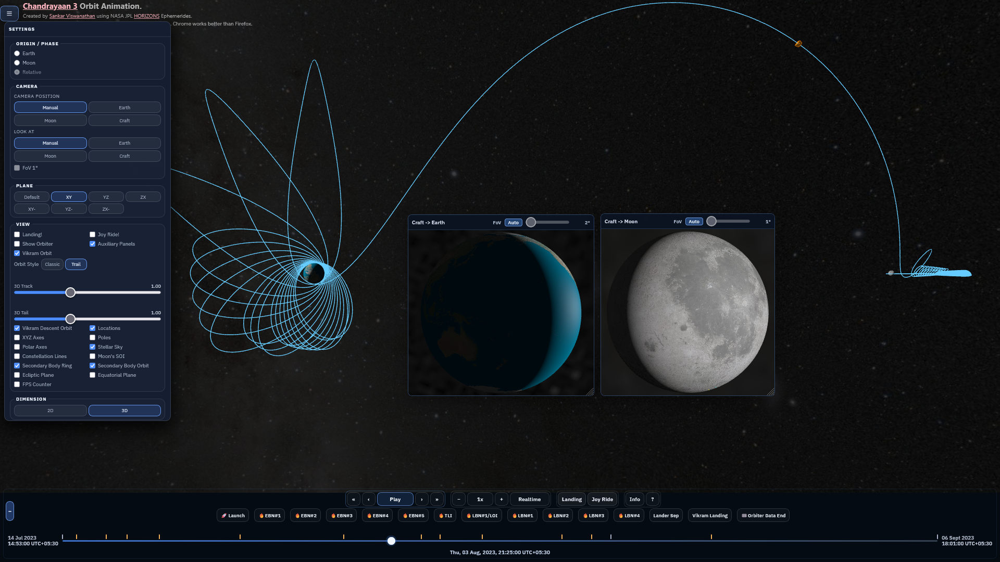

## Moon Mission Orbit Animations

Interactive 2D/3D lunar mission visualizations powered by NASA JPL HORIZONS data and curated runtime ephemeris artifacts.

Live pages:

- Landing/index: <https://sankara.net/astro/lunar-missions/>
- Mission pages: <https://sankara.net/astro/lunar-missions/chandrayaan3/>
- Orbit data status: <https://sankara.net/astro/lunar-missions/orbit-data.html>
- Assets status: <https://sankara.net/astro/lunar-missions/assets-status.html>

The full mission list is in the `Mission Catalog` section later in this README.



## Features

I created this animation for educational purposes. It has the following features:

* Real-world orbit data and predictions based on information available from JPL/NASA HORIZONS interface
* Rendering of the orbit in 2D and 3D
* Rendering with Earth-centered, Moon-centered, and Earth-Moon relative-frame origins
* Header pill strip for fast mission controls (origin, follow/view presets, plane, dimension, and visibility toggles), with synchronized Settings panel controls as fallback
* Multi-craft missions with per-craft styling, visibility pills, and per-craft timeline spans
* Camera from/to controls for mounted viewpoints (spacecraft, Earth, Moon)
* Optional auxiliary camera panels (desktop) for simultaneous craft->Earth and craft->Moon views
* Views aligned with J2000 reference axes
* Information on all earth bound and moon bound maneuvers (engine burns)
* Realistic textures for Earth and Moon in 3D mode
* Astronomically correct rendering of sunlight on Earth and Moon, poles, and polar axes
* Various animation controls for education - camera controls (pan, zoom, rotate), timeline controls, visibility controls
* A Joy Ride feature which lets you fly along with the spacecraft
* Relative-frame mode (`mode=relative`) to view Earth-Moon transfer geometry with Earth->Moon axis fixed
* Mission comparison mode (`mode=compare`) to overlay two missions in a single animation with a shared comparison clock and normalized Earth-Moon distance — see [Orbit Comparison Mode](docs/design/architecture/orbit-comparison-mode.md)
* Selectable orbit styles (`Trail` and `Classic`) with background-loaded style sidecars for authored missions such as CH3
* On startup, if current wall-clock time is within mission data span, runtime can auto-seek to `Now`, switch to realtime speed, and start playback
* Mission brief panels with authored Mission and HORIZONS Data text, programmatic timeline bars, a pilot orbit preview, and curated CC BY-SA image carousels

## Run locally

Prerequisites: Node.js (for the Vite dev server). Python is only needed for orbit-data tooling.

```bash
npm install
npm run dev
```

Open:

- `http://localhost:7274/`
- `http://localhost:7274/index.html`
- `http://localhost:7274/chandrayaan3/`
- `http://localhost:7274/artemis2/?mode=relative`
- `http://localhost:7274/orbit-data.html`
- `http://localhost:7274/assets-status.html`
- `http://localhost:7274/moon-render-tuner.html`
- `http://localhost:7274/sky-render-demo.html`

## Multi-Mission Support

URL parameters:

- `index.html` - Landing page
- `<mission>/` - Open a mission directly using its folder slug from `assets/mission-catalog.json`
- `<mission>/?mode=relative` - Relative-frame mode
- `<mission>/?mode=compare&compareMission=<other>` - Mission comparison mode (see [Orbit Comparison Mode](docs/design/architecture/orbit-comparison-mode.md) for the full URL contract)
- `<mission>/?testMode=true` - Test harness mode for deterministic test behavior
- `mission.html?mission=<folder-slug>` - Legacy shared link form; redirects to the matching clean mission URL

### Mission Controls UI

- Primary quick controls live in the header pill strip (`#header-pill-strip`) in the mission page shell (`mission.html` source template).
- The Settings panel (`#settings-panel`) remains available for the full control set and advanced options.
- Both surfaces are kept in sync through shared underlying inputs/event wiring (`src/platform/js/ui/event-handlers.js`), so changing one updates the other.

### Debugging with NPZ ephemeris

Runtime supports `chebyshev`, `npz`, and `astronomy` body sources, configured per mission via `ephemeris_source` / `ephemeris_sources` in `config.json`.

Current mission configs in this repo are set to `chebyshev` for `SC`, `MOON`, `EARTH`, and `SUN` by default.

For NPZ debugging, set `"ephemeris_source": "npz"` (or per-body overrides), and stage matching `.npz` files (for example `geo-<SC>.npz`, `lunar-<SC>.npz`, and `landing-<SC>-geo.npz` / `landing-<SC>-lunar.npz` when used).

Documentation hub: [docs/README.md](docs/README.md)  
Developer workflow/build/CI guide: [docs/developer.md](docs/developer.md)  
System design index: [docs/design/design.md](docs/design/design.md)

Shared authored mission panel content lives in:

- `assets/mission-briefs.json`
- `assets/mission-images.json`

Mission config authoring workflow:
- edit `assets/*/data/config.json5` (maintainer source with comments)
- compile runtime JSON with `npm run configs:compile` (writes `assets/*/data/config.json`)
- verify sync with `npm run configs:check`
- run `npm run configs:lint` before push when mission config timing or phase/event structure changed; current CI uses this stricter check

## Data Repository Boundary

This repository contains runtime app code, mission config, and UI assets.

Generated orbit/ephemeris artifacts are maintained in the sibling data repository (`moon-mission-data`), including:

- `*-cheb.json`
- `*-cheb.json.gz`
- `*.npz`
- `*-meta.json`
- authored style sidecars such as `geo-style.json` / `lunar-style.json`

App-managed tracked exceptions that stay in this repo include the current Moon runtime profile images under `images/moon/` and social/share images under `images/social/`.

CI/deploy workflows stage those artifacts into this app during build/deploy.

Useful audit commands:

```bash
make data-audit
# or
npm run audit:data-boundary
```

Repo-boundary process details:
- [docs/operations/repo-sync-playbook.md](docs/operations/repo-sync-playbook.md)
- [docs/operations/mission-data-current-state.md](docs/operations/mission-data-current-state.md)

## Design

The animation has 2D and 3D rendering modes. 

The 2D mode uses SVG and D3 JS. Planetary orbits are rendered as ellipses
based on orbital elements. Spacecraft orbits are rendered using line segments
using position data.

The 3D mode uses THREE JS.

jQuery is used in parts of the UI, with a lightweight compatibility dialog shim (`src/platform/js/ui/jquery-ui-dialog-stub.js`) instead of full jQuery UI.

Orbit data is fetched offline from JPL/NASA HORIZONS.
This data is processed and converted into Chebyshev polynomial format for efficient interpolation.
The runtime supports Chebyshev/NPZ/Astronomy body providers, and current mission configs default to Chebyshev for all major bodies.

**Time Systems:** Runtime ephemeris sampling currently uses UTC-based Julian date helpers for
Chebyshev/NPZ lookups, while TDB-based helpers are used for astronomical orientation math
(for example lunar pole calculations). UTC is used for user-facing event times and display.
See [docs/design/design.md](docs/design/design.md) for detailed technical/design notes.

## Testing

The project includes automated testing with Vitest + Playwright.

```bash
make test
```

`make test` runs the primary UI + visual regression suite (`test/ui.test.js`) on `http://localhost:8111`.

Current CI gate:
- `npm run configs:lint`
- `npm run test:unit`

For strategy and full-suite commands (`ui`, `mission-smoke`, `chebyshev-accuracy`), see:
- [docs/guides/testing.md](docs/guides/testing.md)

### Hosting

At present the page can be hosted statically. There are no server components needed.
However, you need to serve it over HTTP (not `file://`) to avoid module/fetch/CORS issues.

### Deployment Data Repository

CI workflows stage runtime mission assets from a separate data repository before publishing. Staged assets include orbit artifacts (`*-cheb.json`, `*-cheb.json.gz`, manifests, optional `.npz` / `*-meta.json`, and orbit-style sidecars such as `geo-style.json` / `lunar-style.json`), mission screenshots (`assets/*/images/`), additional shared runtime media, and optional vendored runtime libraries (`third-party/`).

Tracked app-managed exceptions such as the Moon profile textures under `images/moon/` and share images under `images/social/` are copied from this repo during deploy rather than staged from `moon-mission-data`.

By default workflows use:

- `MISSION_DATA_REPO = kvsankar/moon-mission-data`
- `MISSION_DATA_REF = main`

You can override these via GitHub repository variables with the same names. No extra token is needed when the data repo is public.

Current workflow behavior:

- `.github/workflows/ci.yml` runs on push, pull request, and manual trigger.
- `.github/workflows/deploy-app-only.yml` is manual-only (`workflow_dispatch`) for GitHub Pages app-only deploys.
- `.github/workflows/deploy.yml` is manual-only (`workflow_dispatch`) for GitHub Pages deploys.
- `.github/workflows/deploy-hetzner.yml` is manual-only (`workflow_dispatch`) for sankara.net deploys.

App-only deploys preserve the already-published runtime asset set and are meant for app-shell changes only. Use the full deploy workflows when adding new missions, manifests, or runtime assets. Production (`sankara.net`) currently deploys through the Hetzner workflow, not an app-only workflow.

For development, you can use the Vite dev server:
```bash
npm run dev
```

Or Python's built-in server:
```bash
python -m http.server 7274
```

Or Node.js http-server:
```bash
npx http-server
``` 

### Deployed Version and Audit Artifacts

Each deployment now publishes machine-readable metadata:

- `/deployment/version.json` - deployed app/data repository commits, CI run metadata, and artifact summary
- `/deployment/runtime-asset-manifest.json` - required runtime assets and SHA-256 values from `moon-mission-data`
- `/deployment/file-manifest.json` - file list + SHA-256 for the deployed static tree

For the production site this is available at:

- `https://sankara.net/astro/lunar-missions/deployment/version.json`

The Hetzner deploy workflow also runs a post-deploy parity audit (`rsync --dry-run --checksum --delete`) and fails if the remote tree differs from the staged deployment output.

Quick CLI check:

```bash
python scripts/show-deployed-version.py
```

## Mission Catalog

Current catalog missions are grouped below using the same broad families as the landing page.

### Chandrayaan

- **[Chandrayaan 1](https://sankara.net/astro/lunar-missions/chandrayaan1/)** (India - 2008)
- **[Chandrayaan 2](https://sankara.net/astro/lunar-missions/chandrayaan2/)** (India - 2019)
- **[Chandrayaan 3](https://sankara.net/astro/lunar-missions/chandrayaan3/)** (India - 2023)

### Artemis & Orion

- **[Artemis 1](https://sankara.net/astro/lunar-missions/artemis1/)** (United States - 2022)
- **[Artemis 2](https://sankara.net/astro/lunar-missions/artemis2/)** (United States - 2026)

### Apollo Trailblazers

- **[Apollo 8 S-IVB](https://sankara.net/astro/lunar-missions/apollo8-sivb/)** (United States - 1968)
- **[Apollo 9 S-IVB](https://sankara.net/astro/lunar-missions/apollo9-sivb/)** (United States - 1969)
- **[Apollo 10 LM Snoopy](https://sankara.net/astro/lunar-missions/apollo10-lm/)** (United States - 1969)
- **[Apollo 10 S-IVB](https://sankara.net/astro/lunar-missions/apollo10-sivb/)** (United States - 1969)
- **[Apollo 11 S-IVB](https://sankara.net/astro/lunar-missions/apollo11-sivb/)** (United States - 1969)
- **[Apollo 12 S-IVB](https://sankara.net/astro/lunar-missions/apollo12-sivb/)** (United States - 1969)

### Moon Mapping & Science

- **[Lunar Orbiter 1](https://sankara.net/astro/lunar-missions/lunarorbiter1/)** (United States - 1966)
- **[Clementine](https://sankara.net/astro/lunar-missions/clementine/)** (United States - 1994)
- **[Lunar Prospector](https://sankara.net/astro/lunar-missions/lunar-prospector/)** (United States - 1998)
- **[LRO](https://sankara.net/astro/lunar-missions/lro/)** (United States - 2009)
- **[LADEE](https://sankara.net/astro/lunar-missions/ladee/)** (United States - 2014)
- **[Lunar Trailblazer](https://sankara.net/astro/lunar-missions/lunar-trailblazer/)** (United States - 2025)

### New Cislunar Paths

- **[CAPSTONE](https://sankara.net/astro/lunar-missions/capstone/)** (United States - 2022)
- **[THEMIS-ARTEMIS](https://sankara.net/astro/lunar-missions/artemis/)** (United States - 2007-2011)
- **[THEMIS-ARTEMIS Overview](https://sankara.net/astro/lunar-missions/artemis-overview/)** (United States - 2007-2011)
- **[THEMIS-ARTEMIS Lagrange Transfer](https://sankara.net/astro/lunar-missions/artemis-lagrange/)** (United States - 2010)
- **[THEMIS-ARTEMIS Lunar Capture](https://sankara.net/astro/lunar-missions/artemis-lunar-capture/)** (United States - 2011)
- **[Lunar Flashlight](https://sankara.net/astro/lunar-missions/lunar-flashlight/)** (United States - 2022)
- **[SLIM](https://sankara.net/astro/lunar-missions/slim/)** (Japan - 2023)

### Global Lunar Ambitions

- **[SMART-1](https://sankara.net/astro/lunar-missions/smart1/)** (ESA - 2003)
- **[SELENE / Kaguya](https://sankara.net/astro/lunar-missions/selene/)** (Japan - 2007)
- **[KPLO Danuri](https://sankara.net/astro/lunar-missions/kplo-danuri/)** (South Korea - 2022)
- **[Nozomi](https://sankara.net/astro/lunar-missions/nozomi/)** (Japan - 1998)
- **[JUICE](https://sankara.net/astro/lunar-missions/juice/)** (ESA - 2023)

### Swingbys & Observatories

- **[ISEE-3 / ICE](https://sankara.net/astro/lunar-missions/isee3/)** (United States - 1978)
- **[Wind](https://sankara.net/astro/lunar-missions/wind/)** (United States - 1994)
- **[WMAP](https://sankara.net/astro/lunar-missions/wmap/)** (United States - 2001)
- **[STEREO](https://sankara.net/astro/lunar-missions/stereo/)** (United States - 2006)
- **[TESS](https://sankara.net/astro/lunar-missions/tess/)** (United States - 2018)

### Impact Paths & Companion Craft

- **[GRAIL](https://sankara.net/astro/lunar-missions/grail/)** (United States - 2012)
- **[GRAIL SS Stage](https://sankara.net/astro/lunar-missions/grail-ss-stage/)** (United States - 2011)
- **[LCROSS Shepherd](https://sankara.net/astro/lunar-missions/lcross-shepherd/)** (United States - 2009)
- **[LCROSS Centaur](https://sankara.net/astro/lunar-missions/lcross-centaur/)** (United States - 2009)

### More Missions

- **[HGS-1](https://sankara.net/astro/lunar-missions/hgs1/)** (United States - 1997)

## Credits

* Jon D. Giorgini for helping with the JPL/HORIZONS interface and data. 
  He was very responsive whenever I mailed him my queries.
  He has been of great help since 2013 for the Mars Orbiter Mission until now
  for the Chandrayaan 3 mission.
  
* Members of the Bangalore Astronomy Society (http://bas.org.in/) for their valuable feedback

* Members of the Reddit r/isro (https://www.reddit.com/r/ISRO/) community for their valuable feedback
  
## Planning Notes

Current planning/docs split:

- Runtime architecture and the completed refactor record: [docs/design/architecture/target-architecture.md](docs/design/architecture/target-architecture.md)
- Active product/backlog planning: [docs/design/roadmap/orbit-ux-and-refactor-roadmap.md](docs/design/roadmap/orbit-ux-and-refactor-roadmap.md)
- Historical modernization/refactor plan: [docs/archived/modernization-plan-2026.md](docs/archived/modernization-plan-2026.md)

The broad runtime rearchitecture is effectively complete, so the archived modernization plan is kept for history rather than as the current source of direction.

## AI assistance

See [docs/guides/ai-tools.md](docs/guides/ai-tools.md) for how AI tools are used in this repo (and where tool-specific notes live).

## Inspirations

* https://mgvez.github.io/jsorrery/ 
* https://github.com/Flowm/satvis
* https://github.com/CoryG89/MoonDemo 
* http://stuffin.space/ 
* https://theskylive.com/3dsolarsystem 
